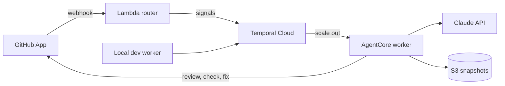

# Agentic Code Review with AgentCore x Temporal

AI agents review GitHub pull requests, orchestrated by Temporal and run as
Serverless Workers on Amazon Bedrock AgentCore. Built as a 15-minute
conference demo that makes durable execution visible on stage.

> **Status: work in progress.** Only the Python workspace and its shared
> building blocks exist today. The infrastructure, the worker, the webhook
> router and the demo repository are being built step by step.

## What the demo shows

- **Scale from zero** — no worker runs at rest; AgentCore starts one when a
  pull request arrives.
- **Parallel agents** — security, performance and maintainability reviewers
  run side by side as Temporal child workflows, then a synthesis agent
  publishes one GitHub review.
- **Durability** — a `/kill` comment stops the AgentCore sessions mid-review;
  the review resumes on a new session without repeating finished LLM calls.
- **Human in the loop** — a `/fix` comment lets an agent push a fix, then an
  incremental review turns the `AI Review` check green.

## Prerequisites

- [uv](https://docs.astral.sh/uv/) (it installs Python 3.14 for you)
- GNU Make

The full demo will also need a Temporal Cloud namespace with mTLS
certificates, an AWS account, an Anthropic API key and a GitHub account.

## Getting started

```bash
git clone <repository-url>
cd temporal-agentcore-review-demo
make install
make check
```

Run `make` to list every available target.

## Usage

| Command        | What it does                                           |
| -------------- | ------------------------------------------------------ |
| `make install` | Install every workspace package and the dev tools      |
| `make dev`     | Run the local worker with hot reload                   |
| `make test`    | Run the unit tests                                     |
| `make lint`    | Check formatting and lint rules                        |
| `make format`  | Format the code                                        |
| `make check`   | Run tests and static checks                            |

`make dev` currently starts a placeholder entry point; the Temporal worker
itself is not implemented yet.

## Configuration

Copy [`.env.example`](.env.example) to `.env` and fill in your values. The
Makefile loads `.env` for every target. Both `.env` and the `certs/`
directory are git-ignored.

## Architecture



One long-lived workflow follows each pull request until it is merged or
closed. Pull requests opened from a `dev/` branch go to a separate task queue
served by the local worker, so you can iterate without redeploying.

| Module   | Description                                                  |
| -------- | ------------------------------------------------------------ |
| `shared` | Contract shared by the router and the worker                 |
| `router` | GitHub webhook handler that turns events into Temporal calls |
| `worker` | Temporal workflows, review agents and their activities       |

## License

This project is licensed under the Apache-2.0 License — see
[LICENSE](LICENSE) for details.
