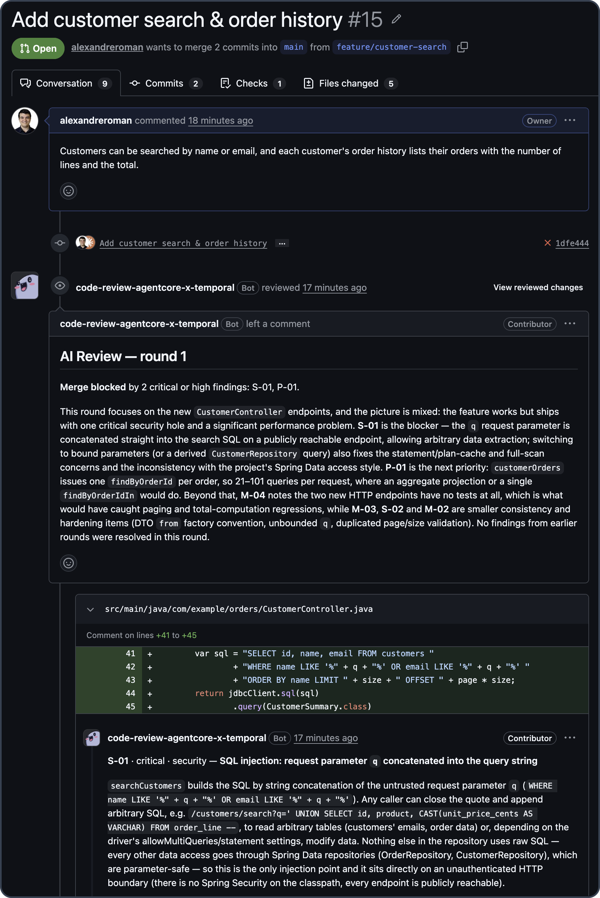

# Code Review with AgentCore x Temporal

[![CI][ci-badge]][ci]
[![License][license-badge]](LICENSE)

[ci]: https://github.com/alexandreroman/code-review-agentcore-temporal/actions/workflows/ci.yml
[ci-badge]: https://github.com/alexandreroman/code-review-agentcore-temporal/actions/workflows/ci.yml/badge.svg
[license-badge]: https://img.shields.io/badge/license-Apache--2.0-blue.svg

Install the GitHub App on a repository and every pull request gets three
AI reviewers. Security, performance and maintainability agents read the
diff and search the repository; a fourth one merges their findings into a
single GitHub review, with comments on the affected lines and an
`AI Review` check.

[Temporal Cloud](https://temporal.io/cloud) runs this agent loop as a
durable workflow, and the integration with
[Amazon Bedrock AgentCore](https://aws.amazon.com/bedrock/agentcore/)
Runtime takes care of the workers. You deploy the worker code to AgentCore
once; Temporal Cloud then starts Serverless Workers there whenever there
is work to do. You never launch a worker process or keep a fleet alive:
between two pull requests, no worker runs and none is billed.

This repository holds the complete system: Temporal workflows and
[Strands](https://strandsagents.com/) agents in Python calling Claude on
Amazon Bedrock, the GitHub webhook router, the OpenTofu infrastructure and
the Make targets that tie them together. Once your AWS, Temporal Cloud and
GitHub accounts are ready ([SETUP.md](SETUP.md)), `make up` deploys it
all. Start from it to run your own agents on AgentCore with Temporal.

> [!NOTE]
> Serverless Workers on AgentCore Runtime is a Temporal Cloud pre-release
> feature, not recommended for production workloads yet.

## Why AgentCore x Temporal

An agent loop needs compute that appears when a task arrives, and state
that outlives that compute. The integration takes each from the platform
built for it:

- **AgentCore Runtime runs the worker.** Each session is an isolated
  microVM with its own IAM role: the worker calls Bedrock, S3 and Secrets
  Manager with that role, without any API key, and its traces land in
  CloudWatch GenAI Observability. No fleet to size, patch or pay for at
  rest.
- **Temporal keeps the agent loop durable.** Retries, timeouts, human input
  and long waits live in a workflow. Every model call and tool call is an
  activity recorded in the workflow history: a discrete, auditable step,
  never repeated once finished.
- **Temporal Cloud connects the two.** A Worker Deployment Version names an
  AgentCore Runtime endpoint as its compute provider, and Temporal Cloud
  invokes it as tasks wait on the queue: starting a worker is its job, not
  yours.

## What the demo shows

- **Scale from zero**: no worker runs at rest; Temporal Cloud starts one on
  AgentCore when a task waits.
- **Parallel agents**: security, performance and maintainability reviewers
  run side by side as Temporal child workflows, then a synthesis agent
  publishes one GitHub review.
- **Durability**: a `/kill` comment stops the AgentCore sessions
  mid-review; the review resumes on a new session without repeating
  finished LLM calls. Durable timers warn on a pull request idle for 10
  minutes, then close it 5 minutes later, across worker restarts and
  deploys.
- **Human in the loop**: a reply to a finding gets an answer from an
  agent, which may dismiss the finding when the human is right. A `/fix`
  comment lets an agent push the smallest local fix, for every open
  finding on the PR or for that finding only in its thread. The next
  round reviews the fix alone, reporting only a critical or high problem
  it introduces, and turns the `AI Review` check green.

<p align="center">
  
</p>

[DEMO.md](DEMO.md) is the timed run-through of a live demo, with its
checklist and recovery actions.

## Architecture

<picture>
  <source media="(prefers-color-scheme: dark)"
    srcset="assets/architecture-dark.png">
  
</picture>

1. The **GitHub App** sends pull request and comment webhooks to a
   **Lambda router**, through its Function URL or, on an optional custom
   domain, through API Gateway. The router checks the signature and turns
   each event into a Temporal signal.
2. One long-lived **`PullRequestWorkflow`** per pull request runs on
   **Temporal Cloud** (mTLS). Each new head commit starts a review round;
   the workflow ends when the pull request is merged or closed, or when it
   closes an idle pull request itself.
3. A round snapshots the repository into **S3**, then runs three
   **reviewer agents** (Strands Agents with Claude on **Amazon Bedrock**)
   as child workflows. They read the diff and navigate the snapshot with
   `Glob`, `Grep` and `Read` tools. A **synthesis** agent deduplicates
   their findings and writes a summary, skipped when a round finds nothing
   new; the workflow publishes the review, findings ordered by severity,
   and sets the `AI Review` check.


## How the project uses the integration

1. **One worker per session.** The AgentCore entry point
   (`worker/src/agentcore_review_worker/agentcore.py`) is a
   `BedrockAgentCoreApp`: the invocation from Temporal Cloud starts a
   Temporal worker as an async task and returns at once. Once no activity
   has run for 60 seconds, the worker drains and completes the task: the
   session turns idle and AgentCore ends it, rather than billing it until
   its maximum lifetime.
2. **Access through IAM and mTLS.** Temporal Cloud assumes a role in the
   AWS account, guarded by an external ID and limited to invoking the
   runtime (`infra/aws/temporal.tf`). The worker connects to Temporal Cloud
   with an mTLS certificate read from Secrets Manager.
3. **Controlled rollout.** `make up` builds an image tagged with a
   build ID derived from its content and publishes it as a new AgentCore
   Runtime version with its own endpoint. It then creates the matching
   Worker Deployment Version, with that endpoint as its compute provider,
   and makes it current. Workflows stay pinned to their version: a review
   started before a deploy finishes on the build that started it, and
   `make prune` removes the endpoints no workflow uses any more.
4. **Strands agents as activities.** The Temporal Strands plugin runs each
   Claude call on Bedrock as an activity, and the `Glob`, `Grep` and
   `Read` tools are activities too. Temporal owns the retries: the Bedrock
   client makes a single attempt per activity.

   
5. **No state tied to a session.** The pre-release binds no worker to a
   session, so nothing relies on one: the workflow history holds the
   progress and S3 the repository snapshots, which a new session copies
   back into its local cache. To stop the sessions on `/kill`, the router
   reads the build and session ID from the identity of each polling
   worker.

## Prerequisites

A Temporal Cloud namespace with Serverless Workers enabled, an AWS account
with access to Claude on Amazon Bedrock, a GitHub account, and a few
command-line tools, including Docker:
[SETUP.md](SETUP.md#1-accounts-and-tools) lists them with their tested
versions.

## Getting started

[SETUP.md](SETUP.md) details every step.

1. Clone this repository and run `make install`.
2. mTLS certificate: [SETUP.md §3](SETUP.md#3-mtls-certificates).
3. `.env`: [SETUP.md §4](SETUP.md#4-configuration-env).
4. Log in to AWS and GitHub: [SETUP.md §5-6](SETUP.md#5-aws-credentials).
5. Start Docker, then deploy everything:

   ```bash
   make up
   ```

At rest, no worker runs: the deployment costs its storage, secrets and KMS
key, a few dollars a month, plus the Bedrock tokens of each review.

## Configuration

`make up` reads `.env`, a copy of [`.env.example`](.env.example), which
documents every setting and its default. Only `TEMPORAL_NAMESPACE` is
required, with the mTLS certificate at `certs/client.pem` and
`certs/client.key`.

## Usage

Commands run from the repository root, with the AWS and GitHub sessions of
[Getting started](#getting-started) open.

Run the demo: see [DEMO.md](DEMO.md).

Maintain:

- `make kill-sessions`: stop every AgentCore session of the task queue.
- `make prune`: after an update, remove the AgentCore endpoints and worker
  versions no workflow uses any more.
- `make delete-workflows`: delete the closed workflows of the namespace.
- `make destroy`: remove the AWS resources, after a confirmation. The
  OpenTofu state bucket, the GitHub App, its credentials and the demo
  repository stay for the next `make up`.

`make help` lists every target.

## Observability

Temporal UI shows every workflow with its activities and child workflows.
Its Workers page lists the AgentCore workers polling the task queue: each
one sends a heartbeat every 10 seconds.

With `TRACING=on` in `.env` (it needs CloudWatch Transaction Search
enabled in the account and region), the worker and the router send
OpenTelemetry traces to CloudWatch: one trace per pull request action (a
round, a fix, a reply) with its workflow, activity and agent spans, without
prompts or file contents. They appear under Application Signals
(Transaction Search) and GenAI Observability. `make up` applies the
setting to the deployed worker and router.

## Validation

`make check` runs the unit tests (review logic, routing, contract, GitHub
error classification) and the static checks. The end-to-end validation
runs against the real infrastructure as a
[Claude Code](https://claude.com/claude-code) project skill:
`/e2e-validation` (smoke, 8 to 10 minutes) or `/e2e-validation full` (about
30 minutes, before a live demo). It opens, fixes and merges pull requests
in the demo repository and reports each step.

## Modules

| Module    | Description                                                   |
| --------- | ------------------------------------------------------------- |
| `shared`  | Contract shared by the router and the worker                  |
| `router`  | GitHub webhook handler that turns events into Temporal calls  |
| `worker`  | Temporal workflows, review agents and their activities        |
| `tools`   | GitHub App registration tooling called by the Makefile        |
| `infra`   | OpenTofu stacks: `bootstrap`, `aws`, `github`                 |
| `scripts` | Shell scripts behind the Make targets                         |
| `demo`    | Demo application that `make up` pushes to the demo repository |

## License

This project is licensed under the Apache-2.0 License — see
[LICENSE](LICENSE) for details.
