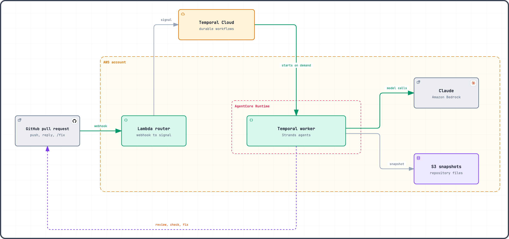

# Code Review with AgentCore x Temporal

[![CI][ci-badge]][ci]
[![License][license-badge]](LICENSE)

[ci]: https://github.com/alexandreroman/code-review-agentcore-temporal/actions/workflows/ci.yml
[ci-badge]: https://github.com/alexandreroman/code-review-agentcore-temporal/actions/workflows/ci.yml/badge.svg
[license-badge]: https://img.shields.io/badge/license-Apache--2.0-blue.svg

Install the GitHub App on a repository and every pull request gets three
AI reviewers. Security, performance and maintainability agents read the
diff and search the repository; a fourth one merges their findings into a
single GitHub review, with comments on the affected lines and an
`AI Review` check. From then on, you work with the agents in the pull
request itself. Reply to a finding and an agent answers, or dismisses the
finding when you are right. Comment `/fix` and an agent commits the fix,
for one finding in its thread or for all of them in the conversation; the
next round reviews it. Comment `/kill` to stop the workers mid-review: the
review resumes on a fresh AgentCore session without redoing a finished
model call.

[Temporal Cloud](https://temporal.io/cloud) runs this agent loop as a
durable workflow, and the integration with
[Amazon Bedrock AgentCore](https://aws.amazon.com/bedrock/agentcore/)
Runtime takes care of the workers. You deploy the worker code to AgentCore
once; Temporal Cloud then starts Serverless Workers there whenever there
is work to do. You never launch a worker process or keep a fleet alive:
between two pull requests, no worker runs and none is billed.

This repository holds the complete system: Temporal workflows and
[Strands](https://strandsagents.com/) agents in Python calling Claude on
Amazon Bedrock, the GitHub webhook router, the OpenTofu infrastructure and
the Make targets that tie them together. Once your AWS, Temporal Cloud and
GitHub accounts are ready ([SETUP.md](SETUP.md)), `make up` deploys it
all. Start from it to run your own agents on AgentCore with Temporal.

> [!NOTE]
> Serverless Workers on AgentCore Runtime is a Temporal Cloud pre-release
> feature, not recommended for production workloads yet.

## Why AgentCore x Temporal

An agent loop needs compute that appears when a task arrives, and state
that outlives that compute. The integration takes each from the platform
built for it:

- **AgentCore Runtime runs the worker.** Each session is an isolated
  microVM with its own IAM role: the worker calls Bedrock, S3 and Secrets
  Manager with that role, without any API key, and its traces land in
  CloudWatch GenAI Observability. No fleet to size, patch or pay for at
  rest.
- **Temporal keeps the agent loop durable.** Retries, timeouts, human input
  and long waits live in a workflow. Every model call and tool call is an
  activity recorded in the workflow history: a discrete, auditable step,
  never repeated once finished.
- **Temporal Cloud connects the two.** A Worker Deployment Version names an
  AgentCore Runtime endpoint as its compute provider, and Temporal Cloud
  invokes it as tasks wait on the queue: starting a worker is its job, not
  yours.

Together, an AgentCore session becomes disposable: whether it idles out,
gets killed or gets replaced by a deploy, the review picks up on a new
session from the workflow history.

## What the demo shows

- **Scale from zero**: no worker runs at rest; Temporal Cloud starts one on
  AgentCore when a task waits.
- **Parallel agents**: security, performance and maintainability reviewers
  run side by side as Temporal child workflows, then a synthesis agent
  publishes one GitHub review.
- **Durability**: a `/kill` comment stops the AgentCore sessions
  mid-review; the review resumes on a new session without repeating
  finished LLM calls. Durable timers warn on a pull request idle for 10
  minutes, then close it 5 minutes later, across worker restarts and
  deploys.
- **Human in the loop**: a reply to a finding gets an answer from an
  agent, which may dismiss the finding when the human is right. A `/fix`
  comment lets an agent push the smallest local fix, for every open
  finding on the PR or for that finding only in its thread. The next
  round reviews the fix alone, reporting only a critical or high problem
  it introduces, and turns the `AI Review` check green.

[DEMO.md](DEMO.md) is the timed run-through of a live demo, with its
checklist and recovery actions.

## Architecture

<picture>
  <source media="(prefers-color-scheme: dark)"
    srcset="assets/architecture-dark.png">
  
</picture>

1. The **GitHub App** sends pull request and comment webhooks to a
   **Lambda router**, through its Function URL or, on an optional custom
   domain, through API Gateway. The router checks the signature and turns
   each event into a Temporal signal.
2. One long-lived **`PullRequestWorkflow`** per pull request runs on
   **Temporal Cloud** (mTLS). Each new head commit starts a review round;
   the workflow ends when the pull request is merged or closed, or when it
   closes an idle pull request itself.
3. A round snapshots the repository into **S3**, then runs three
   **reviewer agents** (Strands Agents with Claude on **Amazon Bedrock**)
   as child workflows. They read the diff and navigate the snapshot with
   `Glob`, `Grep` and `Read` tools. A **synthesis** agent deduplicates and
   orders their findings into a summary, skipped when a round finds
   nothing new; the workflow publishes the review and sets the
   `AI Review` check.
4. Temporal Cloud starts **workers on AgentCore** only when a task waits:
   nothing runs between two events.

## How the project uses the integration

1. **One worker per session.** The AgentCore entry point
   (`worker/src/agentcore_review_worker/agentcore.py`) is a
   `BedrockAgentCoreApp`: the invocation from Temporal Cloud starts a
   Temporal worker as an async task and returns at once. Once no activity
   has run for 60 seconds, the worker drains and completes the task: the
   session turns idle and AgentCore ends it, rather than billing it until
   its maximum lifetime.
2. **Access through IAM and mTLS.** Temporal Cloud assumes a role in the
   AWS account, guarded by an external ID and limited to invoking the
   runtime (`infra/aws/temporal.tf`). The worker connects to Temporal Cloud
   with an mTLS certificate read from Secrets Manager.
3. **Controlled rollout.** `make up` builds an image tagged with a
   build ID derived from its content and publishes it as a new AgentCore
   Runtime version with its own endpoint. It then creates the matching
   Worker Deployment Version, with that endpoint as its compute provider,
   and makes it current. Workflows stay pinned to their version: a review
   started before a deploy finishes on the build that started it, and
   `make prune` removes the endpoints no workflow uses any more.
4. **Strands agents as activities.** The Temporal Strands plugin runs each
   Claude call on Bedrock as an activity, and the `Glob`, `Grep` and
   `Read` tools are activities too. Temporal owns the retries: the Bedrock
   client makes a single attempt per activity.
5. **No state tied to a session.** The pre-release binds no worker to a
   session, so nothing relies on one: the workflow history holds the
   progress and S3 the repository snapshots, which a new session copies
   back into its local cache. To stop the sessions on `/kill`, the router
   reads the build and session ID from the identity of each polling
   worker.

## Prerequisites

Accounts:

- **Temporal Cloud**: a namespace with Serverless Workers enabled
  (pre-release: ask your Temporal contact to enable it), and access to its
  CA certificates.
- **AWS**: an account with administrator access, in a region where
  AgentCore Runtime is available (`ca-central-1` by default), with access
  to Claude Opus 5 on Amazon Bedrock.
- **GitHub**: a personal account or an organization to own the GitHub App
  and the demo repository.

Tools on the machine that deploys: [uv](https://docs.astral.sh/uv/), GNU
Make, [OpenTofu](https://opentofu.org/) 1.12+, the AWS CLI v2, the
Temporal CLI 1.9+, `tcld`, the GitHub CLI, `jq`, and Docker (or a
compatible CLI) able to build `linux/arm64` images.
[SETUP.md](SETUP.md#1-accounts-and-tools) lists the tested versions.

## Getting started

[SETUP.md](SETUP.md) details every step.

1. **Clone and install**:

   ```bash
   git clone https://github.com/<this-repo-owner>/code-review-agentcore-temporal.git
   cd code-review-agentcore-temporal
   make install
   ```

2. **Create the mTLS certificate** that every component presents to
   Temporal Cloud, and add its CA to the namespace:
   [SETUP.md, step 3](SETUP.md#3-mtls-certificates).
3. **Configure**: `cp .env.example .env`, then set `TEMPORAL_NAMESPACE`.
   The other settings, such as the region, the model or the name of the
   demo repository, have defaults: see [Configuration](#configuration).
4. **Log in** to AWS and GitHub:

   ```bash
   aws sso login --profile <profile> && export AWS_PROFILE=<profile>
   gh auth login && gh auth refresh --scopes workflow && gh auth setup-git
   ```

> [!NOTE]
> Temporalites log in to the AWS account with the `access` tool:
>
> ```bash
> access account --aws-account-id <aws-account-id>
> access account --aws-account-id <aws-account-id> --write
> ```

5. **Deploy**, with Docker running:

   ```bash
   make up
   ```

   `make up` creates the AWS resources (Lambda router, ECR repository,
   AgentCore Runtime, IAM roles, S3 bucket, secrets, KMS key), makes the
   worker image the current Temporal Worker Deployment Version, then sets
   up GitHub. On a first run, the browser opens twice: to create the
   GitHub App, then to install it on the demo repository, which `make up`
   fills with the demo application. The command is idempotent: run it
   again after an interruption or a code change.
6. **Try it**: `make ping` checks the scale from zero, then open a pull
   request from `feature/customer-search` to `main` in the demo
   repository. The review arrives within a few minutes.

At rest, no worker runs: the deployment costs its storage, secrets and KMS
key, a few dollars a month, plus the Bedrock tokens of each review.
`make destroy` removes the AWS resources.

## Configuration

`make up` reads `.env`, a copy of [`.env.example`](.env.example) with
plain `KEY=value` lines. Both `.env` and `certs/` are git-ignored.

Required:

- `TEMPORAL_NAMESPACE`: your Temporal Cloud namespace, such as
  `your-namespace.a1b2c`.
- The mTLS client certificate and its key, at `certs/client.pem` and
  `certs/client.key` (step 2 of [Getting started](#getting-started));
  `TEMPORAL_TLS_CERT_PATH` and `TEMPORAL_TLS_KEY_PATH` point elsewhere.

Optional, with their default:

- AWS and model:
  - `AWS_REGION` (`ca-central-1`): the region of every AWS resource,
    where AgentCore Runtime must be available.
  - `BEDROCK_MODEL_ID` (`global.anthropic.claude-opus-5`): the global
    cross-region inference profile of the model.
  - `MODEL_EFFORT` (`high`): how much effort Claude spends per answer,
    from `low` to `max`.
  - `MAX_PARALLEL_AGENTS` (`3`): how many reviewer agents run at once.
- GitHub:
  - `GITHUB_OWNER` (the account logged in to `gh`): an organization to
    own the GitHub App and the demo repository.
  - `DEMO_REPO` (`agentcore-review-demo-app`): the name of the demo
    repository.
  - `GITHUB_APP_NAME` (`Code Review AgentCore x Temporal`): the name of
    the GitHub App, 34 characters at most.
- Behaviour:
  - `PR_IDLE_WARNING_SECONDS` (`600`) and `PR_IDLE_CLOSE_SECONDS` (`900`):
    how long a pull request stays without activity before the bot warns,
    then closes it.
  - `AGENTCORE_IDLE_TIMEOUT` (`120`): seconds before AgentCore stops an
    idle session.
  - `TRACING` (`off`): `on` sends traces to CloudWatch, see
    [Observability](#observability).
- Custom domain: `DOMAIN_NAME`, `SUBDOMAIN` (`codereview`),
  `CLOUDFLARE_ZONE_ID` and `CLOUDFLARE_API_TOKEN` serve the webhook on a
  hostname of a Cloudflare zone, such as `codereview.example.com`, instead
  of the Lambda Function URL: see
  [SETUP.md](SETUP.md#custom-domain-cloudflare-optional).

`.env.example` documents the remaining settings, such as the task queue
and the Worker Deployment name.

## Usage

Commands run from the repository root, with the AWS and GitHub sessions of
[Getting started](#getting-started) open.

Deploy and update:

- `make up`: deploy everything, in order: AWS resources, worker, GitHub
  App and demo repository. Run it again after pulling a new version of
  this repository: it builds and activates a new worker version only when
  the worker code changed.
- `make ping`: run the Ping workflow on AgentCore, for which Temporal
  Cloud starts a worker (scale from zero).

Run the demo:

- Open a pull request from `feature/customer-search` to `main` in the demo
  repository, then reply to a finding, or comment `/fix` or `/kill`.
- Reset the demo repository between two runs: in its **Actions** tab,
  **Reset demo**, **Run workflow**, or
  `gh workflow run reset-demo.yml --repo <owner>/agentcore-review-demo-app`.
  The reset closes the open pull requests and recreates the scenario
  branches.

Maintain:

- `make kill-sessions`: stop every AgentCore session of the task queue.
- `make prune`: after an update, remove the AgentCore endpoints and worker
  versions no workflow uses any more.
- `make destroy`: remove the AWS resources, after a confirmation. The
  OpenTofu state bucket, the GitHub App, its credentials and the demo
  repository stay for the next `make up`.

`make help` lists every target.

## Observability

Temporal UI shows every workflow with its activities and child workflows.
Its Workers page lists the AgentCore workers polling the task queue: each
one sends a heartbeat every 10 seconds.

With `TRACING=on` in `.env` (it needs CloudWatch Transaction Search
enabled in the account and region), the worker and the router send
OpenTelemetry traces to CloudWatch: one trace per pull request action (a
round, a fix, a reply) with its workflow, activity and agent spans, without
prompts or file contents. They appear under Application Signals
(Transaction Search) and GenAI Observability. `make up` applies the
setting to the deployed worker and router.

## Validation

`make check` runs the unit tests (review logic, routing, contract, GitHub
error classification) and the static checks. The end-to-end validation
runs against the real infrastructure as a
[Claude Code](https://claude.com/claude-code) project skill:
`/e2e-validation` (smoke, 8 to 10 minutes) or `/e2e-validation full` (about
30 minutes, before a live demo). It opens, fixes and merges pull requests
in the demo repository and reports each step.

## Modules

| Module    | Description                                                   |
| --------- | ------------------------------------------------------------- |
| `shared`  | Contract shared by the router and the worker                  |
| `router`  | GitHub webhook handler that turns events into Temporal calls  |
| `worker`  | Temporal workflows, review agents and their activities        |
| `tools`   | GitHub App registration tooling called by the Makefile        |
| `infra`   | OpenTofu stacks: `bootstrap`, `aws`, `github`                 |
| `scripts` | Shell scripts behind the Make targets                         |
| `demo`    | Demo application that `make up` pushes to the demo repository |

## License

This project is licensed under the Apache-2.0 License — see
[LICENSE](LICENSE) for details.
