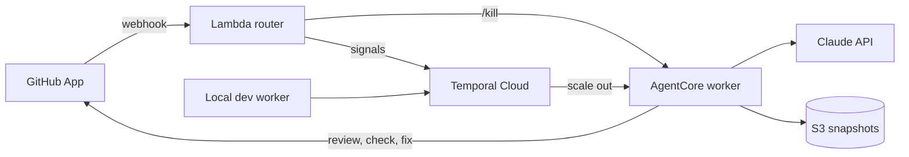

# Code Review with AgentCore x Temporal

AI agents review GitHub pull requests, orchestrated by Temporal and run as
Serverless Workers on Amazon Bedrock AgentCore. Built as a 15-minute
conference demo that makes durable execution visible on stage.

## What the demo shows

- **Scale from zero**: no worker runs at rest; Temporal Cloud starts one on
  AgentCore when a task waits.
- **Parallel agents**: security, performance and maintainability reviewers
  run side by side as Temporal child workflows, then a synthesis agent
  publishes one GitHub review.
- **Durability**: a `/kill` comment stops the AgentCore sessions
  mid-review; the review resumes on a new session without repeating
  finished LLM calls.
- **Human in the loop**: a `/fix` comment lets an agent push a fix, then an
  incremental review turns the `AI Review` check green.

[DEMO.md](DEMO.md) is the timed run-through of the talk, with its
checklist and plan B.

## Architecture



1. The **GitHub App** sends pull request and comment webhooks to a
   **Lambda router**, through its Function URL or, on an optional custom
   domain, through API Gateway. The router checks the signature and turns
   each event into a Temporal signal; `/kill` also stops the AgentCore
   sessions.
2. One long-lived **`PullRequestWorkflow`** per pull request runs on
   **Temporal Cloud** (mTLS). Each new head commit starts a review round;
   the workflow ends when the pull request is merged or closed.
3. A round snapshots the repository into **S3**, then runs three
   **reviewer agents** (Strands Agents with Claude, through the Anthropic
   API) as child workflows. They read the diff and navigate the snapshot
   with `Glob`, `Grep` and `Read` tools. A **synthesis** agent deduplicates
   and orders their findings into a summary, skipped when a round finds
   nothing new; the workflow publishes the review and sets the
   `AI Review` check.
4. Temporal starts **workers on AgentCore** only when a task waits:
   nothing runs between two events. Every model call and tool call is an
   activity, so a killed session loses nothing but the call in flight.
5. Pull requests from a `dev/` branch go to a separate task queue served
   by a **local worker** (`make dev`), against the same namespace.

## Prerequisites

- [uv](https://docs.astral.sh/uv/) (it installs Python 3.14 for you), GNU
  Make (the 3.81 shipped with macOS is enough) and
  [OpenTofu](https://opentofu.org/) 1.12
- To deploy: AWS CLI v2, the [Temporal CLI](https://docs.temporal.io/cli)
  and `tcld`, the GitHub CLI, `jq`, and Docker or a Docker-compatible CLI
  (arm64 image builds)
- A Temporal Cloud namespace with Serverless Workers enabled, an AWS
  account, an Anthropic API key and a GitHub account

## Getting started

```bash
git clone https://github.com/<owner>/code-review-agentcore-temporal.git
cd code-review-agentcore-temporal
make install
make check
```

[SETUP.md](SETUP.md) walks through the whole installation: mTLS
certificates, `.env`, AWS login, `make up`, the GitHub App and the demo
repository.

## Usage

Develop:

- `make install`: install every workspace package and the dev tools.
- `make check`: run the unit tests, the lint rules and the OpenTofu checks.
- `make dev`: run the local worker on the dev task queue, with hot reload.
- `make review-pr PR=<n>`: drive a pull request's workflow by hand.

Operate:

- `make up`: deploy everything, in order (idempotent), and point the
  GitHub App's webhook at the router.
- `make deploy`: build, push and activate a new worker version.
- `make ping`: run the Ping workflow on AgentCore (scale from zero).
- `make kill-sessions`: stop the AgentCore sessions of the task queue.
- `make prune`: remove the endpoints no workflow uses any more.
- `make destroy`: destroy the AWS resources, after a confirmation; the
  GitHub App and its credentials stay for the next `make up`.

`make help` lists every target with its description.

## Configuration

Copy [`.env.example`](.env.example) to `.env` and set `TEMPORAL_NAMESPACE`
and `ANTHROPIC_API_KEY`; the file documents every other setting with its
default. The Makefile loads `.env` for every target. Both `.env` and the
`certs/` directory are git-ignored.

Optionally, `DOMAIN_NAME`, `SUBDOMAIN`, `CLOUDFLARE_ZONE_ID` and
`CLOUDFLARE_API_TOKEN` serve the webhook on a custom domain of a
Cloudflare zone, such as `codereview.example.com`: see
[SETUP.md](SETUP.md#custom-domain-cloudflare-optional).

## Validation

`make check` runs the unit tests (review logic, routing, contract) and the
static checks. The end-to-end validation runs against the real
infrastructure as a [Claude Code](https://claude.com/claude-code) project
skill: `/e2e-validation` (smoke, 6 to 8 minutes) or `/e2e-validation full`
(about 30 minutes, before a talk). It opens, fixes and merges pull requests
in the demo repository and reports each step.

## Modules

| Module    | Description                                                  |
| --------- | ------------------------------------------------------------ |
| `shared`  | Contract shared by the router and the worker                 |
| `router`  | GitHub webhook handler that turns events into Temporal calls |
| `worker`  | Temporal workflows, review agents and their activities       |
| `tools`   | GitHub App registration tooling called by the Makefile       |
| `infra`   | OpenTofu stacks: `bootstrap`, `aws`, `github`                |
| `scripts` | Shell scripts behind the Make targets                        |

## License

This project is licensed under the Apache-2.0 License — see
[LICENSE](LICENSE) for details.
