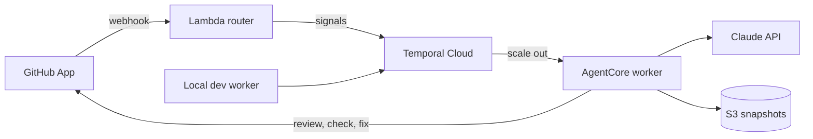

# Agentic Code Review with AgentCore x Temporal

AI agents review GitHub pull requests, orchestrated by Temporal and run as
Serverless Workers on Amazon Bedrock AgentCore. Built as a 15-minute
conference demo that makes durable execution visible on stage.

> **Status: work in progress.** The infrastructure, the deployment tooling
> and a minimal worker are in place; the review agents, the webhook routing
> and the demo repository are being built step by step.

## What the demo shows

- **Scale from zero** — no worker runs at rest; AgentCore starts one when a
  pull request arrives.
- **Parallel agents** — security, performance and maintainability reviewers
  run side by side as Temporal child workflows, then a synthesis agent
  publishes one GitHub review.
- **Durability** — a `/kill` comment stops the AgentCore sessions mid-review;
  the review resumes on a new session without repeating finished LLM calls.
- **Human in the loop** — a `/fix` comment lets an agent push a fix, then an
  incremental review turns the `AI Review` check green.

## Prerequisites

- [uv](https://docs.astral.sh/uv/) (it installs Python 3.14 for you)
- GNU Make (the 3.81 shipped with macOS is enough)
- To deploy: [OpenTofu](https://opentofu.org/) 1.12, AWS CLI v2 with
  credentials, the [Temporal CLI](https://docs.temporal.io/cli), the
  GitHub CLI (`gh auth login`), `jq`, and Docker or a Docker-compatible
  CLI (arm64 image builds)
- A Temporal Cloud namespace with Serverless Workers enabled and an mTLS
  client certificate, an Anthropic API key, and a GitHub account

## Getting started

```bash
git clone <repository-url>
cd temporal-agentcore-review-demo
make install
make check
```

Run `make` to list every available target.

### Deploy

1. Copy `.env.example` to `.env`, then set `TEMPORAL_NAMESPACE` and
   `ANTHROPIC_API_KEY`. Put the client certificate and key in
   `certs/client.pem` and `certs/client.key`.
2. Run `make up`. The first run creates the AWS side and deploys the
   worker, then stops: the GitHub App does not exist yet.
3. Run `make github-app` and click "Create GitHub App" in the browser.
4. Run `make up` again. It creates the demo repository, then prints the
   link to install the app on it.
5. Check scale-from-zero with `make ping`: a worker starts on AgentCore
   and answers.

## Usage

| Command              | What it does                                  |
| -------------------- | --------------------------------------------- |
| `make install`       | Install every workspace package and dev tools |
| `make dev`           | Run the local worker with hot reload          |
| `make check`         | Run tests, lint and OpenTofu checks           |
| `make up`            | Deploy everything (idempotent)                |
| `make github-app`    | Register the GitHub App (interactive, once)   |
| `make deploy`        | Build, push and activate a new worker version |
| `make ping`          | Run the Ping workflow on AgentCore            |
| `make kill-sessions` | Stop the AgentCore sessions of the queue      |
| `make prune`         | Remove endpoints no workflow still uses       |
| `make destroy`       | Destroy the AWS resources (with confirmation) |

## Configuration

Copy [`.env.example`](.env.example) to `.env` and fill in your values. The
Makefile loads `.env` for every target. Both `.env` and the `certs/`
directory are git-ignored.

## Architecture



One long-lived workflow follows each pull request until it is merged or
closed. Pull requests opened from a `dev/` branch go to a separate task queue
served by the local worker, so you can iterate without redeploying.

| Module   | Description                                                  |
| -------- | ------------------------------------------------------------ |
| `shared` | Contract shared by the router and the worker                 |
| `router` | GitHub webhook handler that turns events into Temporal calls |
| `worker` | Temporal workflows, review agents and their activities       |
| `tools`  | Deployment tooling called by the Makefile                    |
| `infra`  | OpenTofu stacks: `bootstrap`, `aws`, `github`                |

## License

This project is licensed under the Apache-2.0 License — see
[LICENSE](LICENSE) for details.
